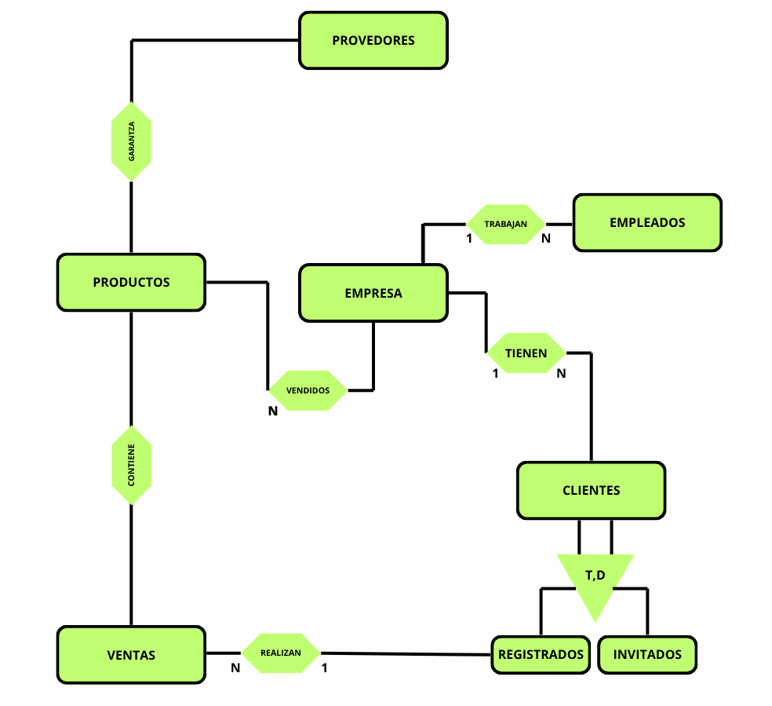

# `DEEP SOUND`
- **HERRAMIENTAS** USADAS PARA EL **PROYECTO**

<html>
    <table>
        <tr>
            <td></td>
            <td></td>
            <td></td>
            <td></td>
            <td></td>
            <td></td>
        </tr>
    </table>
</html>

--- 
>[!NOTE]
> **MEMORIA DEL PROYECTO**
> - **Identificar una necesidad o problema real:**
> La gente para comprar productos de produccion musical deben ir a una pagina de una marca expecifica a comprar ciertos productos, nosotros vamos a ser una pagina polivalente de marcas, es decir, de un solo producto vamos a tener muchas marcas con diferentes precios y asi para los clientes sera mas comodo la compra y la comprobacion de productos/precios.
>- **Definir el propósito de la aplicación:**
>Ser una pagina web que haga intermediario entre las diferentes marcas de productos musicales y los clientes.
>- **Identificar a los usuarios:**
> El tipo de usuarios que vamos a tener son personas que les encante la musica, o que trabajen de ello, ya sean productores, musicos, cantantes, etc.
>- **Determinar el alcance del proyecto:**
>Nuestro alcance seria hacer envios internacionales 
> - **Establecer requisitos funcionales y no funcionales:**
> `1.Funcionales: `Pueden entrar 2 tipos de clientes:  <small>(USUARIO REGISTRADO/ USUARIO INVITADO)</small> , podran tener un carro de productos, pueden añadir saldo o pagar direcctamente, tendran varias formas de pagar, una seleccion de idiomas, categorias de productos, y mas...
> `2.No funcionales: ` La pagina tiene que estar tan optimizada que debe cargar lo mas rapido posible, la pagina debe estar adaptada a cualquier dispositivo, las cuentas de nuestros clientes tienen que ser seguras.
> - **Seleccionar y justificar las tecnologías principales** 
> >`FRONTEND : HTML,CSS,JS`
> `BACKEND : PHP\LARAVEL`
> `BD : MYSQL`

---
### DISEÑO FISICO
Para crear una entidad relacion para la empresa necesitaremos:

> [!WARNING]
> **PROVEDORES** garantiza **PRODUCTOS** a la **EMPRESA**.
> En la **EMPRESA** trabajan **EMPLEADOS**.
> La **EMPRESA** tiene unos **CLIENTES**
> Esos **CLIENTES REGISTRADOS** realizan **VENTAS**
> Los **CLIENTES** o estan **REGISTRADOS** o son **INVITADOS**
> **VENTAS** contienen **PRODUCTOS**

___

| Tipo | Tabla / Entidad | Clave Primaria (PK) | Claves Foráneas (FK) | Campos / Atributos |
| :--- | :--- | :--- | :--- | :--- |
| **Entidad Principal** | `EMPRESA` | `id_empresa` | *Ninguna* |id_empresa, nom_empresa, |
| **Entidad Principal** | `PROVEEDORES` | `id_proveedor` | *Ninguna* |id_provedor, nom_provedor|
| **Entidad Dependiente** | `EMPLEADOS` | `id_empleado` | `id_empresa` -> `EMPRESA` | id_empleado, id_empresa , nombre , apellido , DNI , correo, salario  |
| **Entidad Dependiente** | `CLIENTES` (Superclase) | `id_cliente` | `id_empresa` -> `EMPRESA` | cod_cliente |
| **Subclase** | `REGISTRADOS` | `id_cliente` | `id_cliente` -> `CLIENTES` | |
| **Subclase** | `INVITADOS` | `id_cliente` | `id_cliente` -> `CLIENTES` | |
| **Entidad / Relación** | `PRODUCTOS` | `id_producto` | `id_proveedor` -> `PROVEEDORES`, `id_empresa` -> `EMPRESA` | |
| **Entidad Dependiente** | `VENTAS` | `id_venta` | `id_cliente` -> `REGISTRADOS` | |
| **Tabla Intermedia** | `DETALLE_VENTA` *(Contiene)* | (`id_venta`, `id_producto`) | `id_venta` -> `VENTAS`, `id_producto` -> `PRODUCTOS` | |